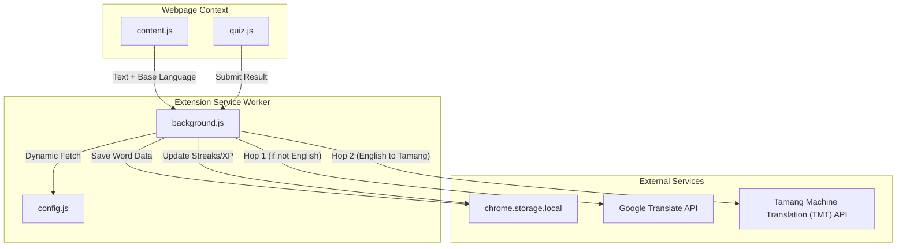

# Immerse

**Immerse** is an innovative Google Chrome extension that helps you learn the **Tamang language** effortlessly while browsing the web. Instead of dedicating separate time to study, Immerse brings the language directly into your daily reading by intelligently replacing words on webpages with their Tamang equivalents. 

It tracks your vocabulary exposure, reinforces learning through active recall quizzes, and even supports learning Tamang from multiple base languages (English, German, French, and Chinese).

---

## 🌟 Key Features

### 1. Passive Immersion (Smart Text Replacement)
Immerse securely scans the text of the websites you visit and replaces a percentage of the words with Tamang translations. The frequency of these replacements is controlled by a **Difficulty Slider** in the extension popup. Hover over any translated word to see the original text.

### 2. Multi-Language Base Support
You aren't restricted to learning Tamang from English! Immerse features a robust **Double-Hop Translation Engine**. If you select German, French, or Chinese as your Base Language:
- The extension captures the foreign text.
- It uses the Google Translate API to convert it to an intermediate English string.
- It then queries the Tamang Machine Translation (TMT) API to accurately translate the English into Tamang.

### 3. Active Recall Quizzes & Gamification
Learning passively isn't enough to achieve fluency. When you interact with translated words, the extension occasionally challenges you with **Interactive Quiz Cards**. 
- You will be asked to translate words from your Base Language to Tamang, or vice-versa.
- The quizzes feature a **Romanized Devanagari Engine** that automatically converts your Latin keystrokes into Devanagari script when typing Tamang answers.
- As you complete quizzes, you earn **XP**, maintain daily **streaks**, and track your accuracy.

### 4. Native Text-To-Speech (TTS)
When interacting with words or quizzes, you can click the speaker icon to hear the pronunciation. Immerse dynamically hooks into your operating system's native voices based on your Base Language (e.g., `de-DE` for German, `zh-CN` for Chinese) while using a localized Nepali fallback for Tamang.

### 5. Vocabulary Knowledge Graph
Immerse tracks every unique word you've learned. By opening the extension's **Options Page**, you can view an interactive, force-directed **Knowledge Graph** visualizing your entire vocabulary network, along with charts detailing your quiz performance. 

---

## 🏗️ Architecture & Technology Stack

Built natively on **Chrome Manifest V3**, Immerse utilizes modern browser APIs and pure Vanilla JavaScript/CSS for maximum performance without heavy framework overhead.

| Component | Files | Description |
|---|---|---|
| **Service Worker** | `background.js`, `config.js` | The central brain. Handles translation caching, secure API requests to TMT/Google Translate, and saves vocabulary state to `chrome.storage.local`. |
| **Content Engine** | `content.js`, `content.css` | Scans the DOM via `TreeWalker`, extracts translatable nodes without breaking HTML structure, and renders the hover tooltips. |
| **Interactive Quiz** | `quiz.js`, `quiz.css` | Injects isolated DOM overlays for the quiz challenges and handles answer evaluation with fuzzy-matching logic. |
| **Popup UI** | `popup/` | A sleek, minimalist control widget to select your Base Language and adjust learning difficulty. |
| **Dashboard** | `options/` | Renders the immersive Knowledge Graph using HTML5 Canvas and mathematical physics algorithms. |

### System Data Flow


---

## 🚀 Getting Started

### Prerequisites
- Google Chrome (or any Chromium-based browser like Edge, Brave).

### Installation & Configuration

1. **Clone the repository:**
   ```bash
   git clone https://github.com/shri-acha/immerse.git
   cd immerse
   ```

2. **Configure API Keys:**
   Immerse dynamically loads environment variables at runtime inside the service worker. You must create a `.env` file in the root directory and add your TMT API Key:
   ```env
   TMT_API_KEY=your_actual_api_key_here
   ```

3. **Load the Extension:**
   - Open Chrome and navigate to `chrome://extensions/`.
   - Enable **Developer mode** using the toggle in the top-right corner.
   - Click **Load unpacked** and select the cloned `immerse` directory.

4. **Start Learning:**
   - Pin the Immerse extension icon to your toolbar.
   - Click it to open the popup, select your Base Language, and adjust your difficulty level.
   - Browse the web normally and watch the language come to life!

---

## 📄 License
This project is provided as-is for educational and research purposes. Translations are powered by the [Tamang Machine Translation (TMT) API](https://tmt.ilprl.ku.edu.np) developed by Kathmandu University.