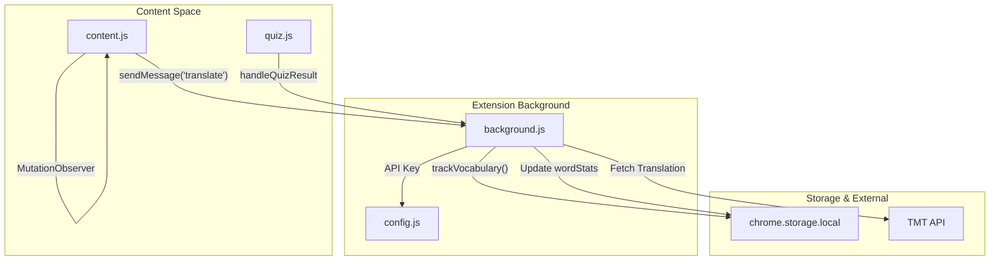

# Immerse  
  
A Chrome browser extension that helps you learn the **Tamang language** passively while browsing the web. It replaces English words on webpages with Tamang translations, tracks your vocabulary exposure, and reinforces learning through interactive quizzes.  
  
## Features  
  
- **Passive Immersion** — Automatically replaces a percentage of English text on any webpage with Tamang translations, based on your chosen difficulty level.  
- **Vocabulary Tracking & Knowledge Graph** — Tracks every word you encounter, building a knowledge graph of word frequencies and co-occurrences, visualized as a force-directed graph on the Options page.  
- **Active Recall Quizzes** — In-page quiz cards prompt you to translate Tamang words back to English (and vice versa), with a built-in Roman-to-Devanagari transliteration engine.  
- **Gamification** — Earn XP, maintain streaks, and track quiz metrics to stay motivated.  
- **Highlight-to-Translate** — Manually highlight text on any page to get an instant Tamang translation.  
- **Data Export** — Export your vocabulary data as JSON or CSV from the Options page.  
  
## Architecture  
  
Built on **Chrome Manifest V3**. The extension consists of:  
  
| Component | File(s) | Role |  
|---|---|---|  
| **Background Service Worker** | `background.js`, `config.js` | Manages translation cache, API calls to the TMT service, and persistent storage of user progress. |  
| **Content Script** | `content.js`, `content.css` | Scans the DOM via `TreeWalker`, identifies translatable text nodes, and applies Tamang replacements. |  
| **Quiz System** | `quiz.js`, `quiz.css` | Injects interactive quiz cards for active recall, includes Devanagari transliteration. |  
| **Popup UI** | `popup/` | Quick-access interface for toggling modes and viewing daily stats. |  
| **Options / Dashboard** | `options/` | Renders the vocabulary knowledge graph and provides data export. |  
| **Dictionary Data** | `data/nepali_dict.json` | Local dictionary used for lookups and translations. |  
  

  
## Getting Started  
  
### Prerequisites  
  
- Google Chrome (or any Chromium-based browser)  
  
### Installation  
  
1. Clone this repository:  
   ```bash  
   git clone https://github.com/shri-acha/immerse.git  
   ```  
2. Open Chrome and navigate to `chrome://extensions/`.  
3. Enable **Developer mode** (toggle in the top-right corner).  
4. Click **Load unpacked** and select the cloned `immerse` directory.  
5. The **Immerse** extension icon should appear in your toolbar.  
  
### Configuration  
  
Before using the extension, update the API key in `config.js`:  
  
```js  
export const config = {  
  TMT_API_KEY: "your_actual_api_key_here"  
};  
```  
  
The extension communicates with the [Tamang Machine Translation (TMT) API](https://tmt.ilprl.ku.edu.np) for translations.  
  
## Usage  
  
1. **Click the extension icon** in the toolbar to open the popup. Toggle immersion on/off and set your difficulty level.  
2. **Browse the web** — English text will be partially replaced with Tamang translations.  
3. **Hover over translated words** to see the original English text.  
4. **Complete quizzes** that appear on the page to reinforce your learning.  
5. **Open the Options page** (right-click the extension icon → Options) to view your vocabulary knowledge graph and export data.  
  
## Project Structure  
  
```  
immerse/  
├── background.js        # Service worker: translation cache, API, storage  
├── config.js           g # TMT API key configuration  
├── content.js           # DOM scanning and text replacement  
├── content.css          # Styles for translated text overlays  
├── quiz.js              # Quiz logic and transliteration engine  
├── quiz.css             # Quiz card styles and animations  
├── manifest.json        # Chrome MV3 extension manifest  
├── data/  
│   └── nepali_dict.json # Local dictionary data  
├── options/  
│   ├── options.html     # Knowledge graph dashboard page  
│   ├── options.js       # Force-directed graph rendering & export  
│   └── options.css      # Dashboard styles  
└── popup/  
    ├── popup.html       # Popup UI  
    ├── popup.js         # Popup controls & state management  
    └── popup.css        # Popup styles  
```  
  
## License  
  
This project is provided as-is for educational and research purposes.